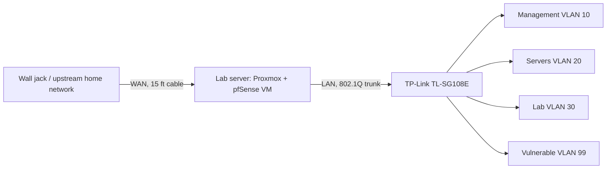

```mermaid
flowchart LR
    A[Wall jack / upstream home network] -->|WAN, 15 ft cable| B[Lab server: Proxmox + pfSense VM]
    B -->|LAN, 802.1Q trunk| C[TP-Link TL-SG108E]
    C --> D[Management VLAN 10]
    C --> E[Servers VLAN 20]
    C --> F[Lab VLAN 30]
    C --> G[Vulnerable VLAN 99]
```
